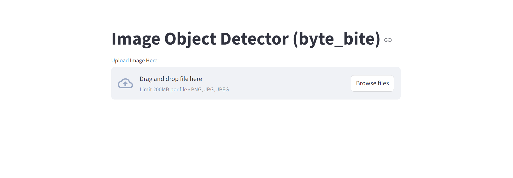
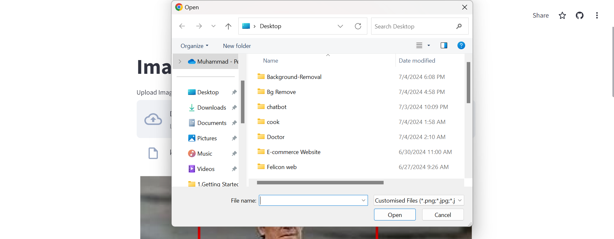
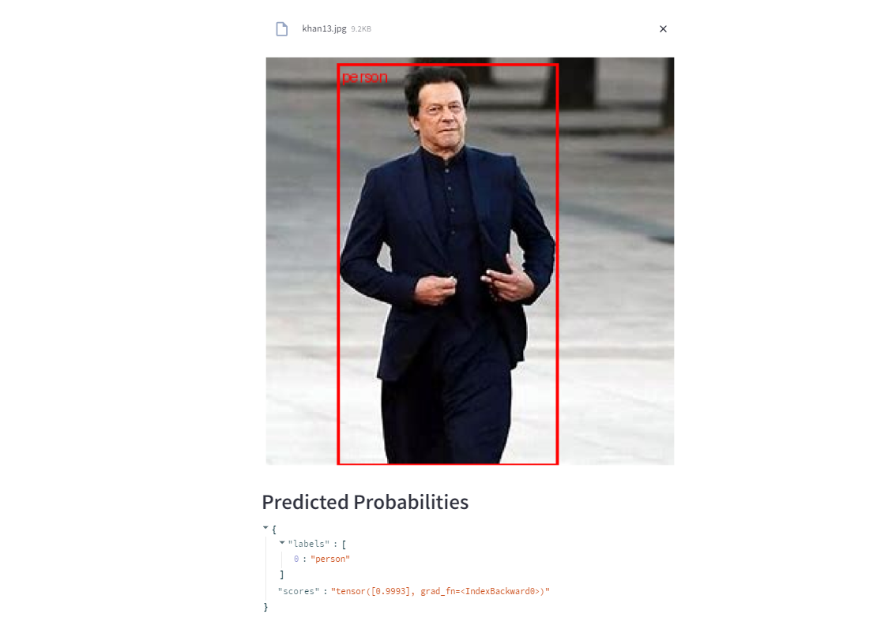

# Image Object Detector (byte_bite)

A Streamlit application that allows users to upload images and automatically detect objects within them using the Faster R-CNN model with ResNet-50 backbone.

## Features

- **Upload Image:** Users can upload images in PNG, JPG, or JPEG formats.
- **Real-Time Detection:** Detects objects and displays bounding boxes around them.
- **Category Labels:** Identifies and labels objects from a predefined category list.
- **Visual Display:** Presents images with bounding boxes using Matplotlib for clear visualization.

## How It Works
 
1. **Upload Image:** User uploads an image.
2.  
3. **Preprocess Image:** Image is preprocessed to the required format.
4. **Make Prediction:** Model predicts bounding boxes and labels for objects.
5.  
6. **Display Results:** Image with bounding boxes is displayed along with predicted probabilities.

## Installation

1. Clone the repository:
   ```bash
   git clone https://github.com/your-username/your-repo-name.git
   cd your-repo-name
